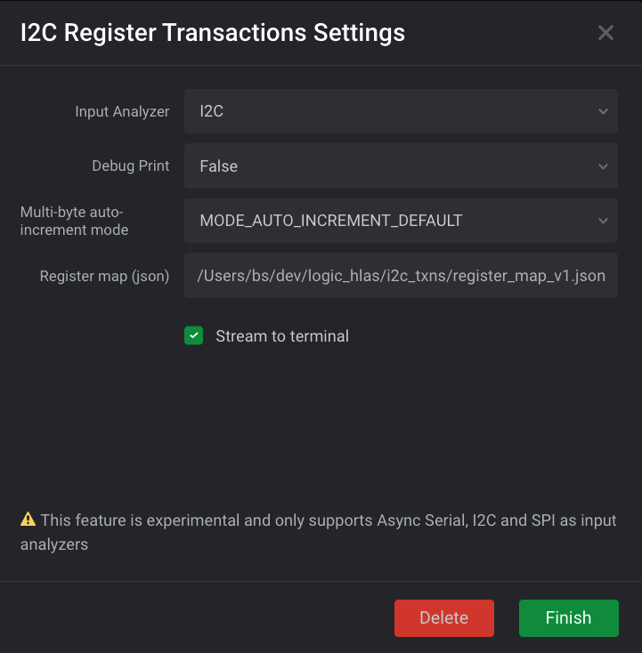

# I2C Address Regs

A simple HLA for Saleae Logic 2.0 that packages raw I2C analyzer frames into read/write transactions between a master and a slave that uses address-based registers

## Status

**Only tested with repeated starts**

The code that packages the I2C frames into transactions is currently tangled with register name mapping code. I'm hoping to extract into a higher-level HLA if possible, bbut for now my plans are:

* Test support for arbitrary register maps
* Add higher-level register mapper with support for bitwise operation tracking

Possible additions:
* Write to file
* User provided format strings?

## Usage/Docs
Basic installation instructions from the code this was ripped off from:

https://github.com/saleae/logic2-extensions/tree/master/hla_gyroscope#try-it-for-yourself

Here's Saleae's docs on how High Level Analyzers can be written:

https://github.com/saleae/logic2-extensions#high-level-protocol-analyzers

### Settings
It's pretty slim pickin's at this point, but there are a few settings:



* **Input Analyzer** - For now I2C only
* **Debug Print** - Set to True to print additional info to the console that may be helpful for debugging
* **Multi-byte auto-increment mode** - How to tell the sensor to auto-increment the address being written to or read from during multi-byte transactions. Some sensors require setting the MSBit of the register address, others auto-increment by default 
* **Register Map(JSON)** A text file path to a JSON formatted register map with some **caveats**
  * Currently it's pretty tightly coupled to the ICM-20948/ICM-20649 due to its use of banks
  * Because I had a dumb, the address keys are strings, not ints. I'll fix this shortly

```javascript
[
  {
    "0": {
      "name": "WHO_AM_I",
      "rw": "R",
      "fields": [
        "WHO_AM_I[7:0]"
      ]
    },
    "45": {
      "name": "ACCEL_XOUT_H",
      "rw": "R",
      "fields": [
        "ACCEL_XOUT_H[7:0]"
      ]
    },
    "46": {
      "name": "ACCEL_XOUT_L",
      "rw": "R",
      "fields": [
        "ACCEL_XOUT_L[7:0]"
      ]
    },
    "127": {
      "name": "BANK",
      "rw": "R/W",
      "fields": [
        "BANK[7:0]"
      ]
    }
  },

  {
    "1": {
      "name": "GYRO_CONFIG_1",
      "rw": "R",
    "fields": [
      "",
      "",
      "",
      "GYRO_DLPFCFG[2:0]",
      "GYRO_DLPFCFG[2:0]",
      "GYRO_DLPFCFG[2:0]",
      "GYRO_FS_SEL[1:0]",
      "GYRO_FS_SEL[1:0]",
      "GYRO_FCHOICE"]
    },
    "20": {
      "name": "ACCEL_CONFIG",
      "rw": "R/W",
      "fields": [
        "",
        "",
        "",
        "ACCEL_DLPFCFG[2:0]",
        "ACCEL_DLPFCFG[2:0]",
        "ACCEL_DLPFCFG[2:0]",
        "ACCEL_FS_SEL[1:0]",
        "ACCEL_FS_SEL[1:0]",
        "ACCEL_FCHOICE"
      ]
    }
  }
]
```
As it stands, the code expects to get a ordered list of objects with each object representing a bank of registers. Each bank has keys for the different addresses, and the value for each address key is a name, read/write type and a list of fields

## Attribution
~~Derived from~~ A refactored ripoff of the [Example Gyroscope HLA](https://github.com/saleae/logic2-extensions/tree/master/hla_gyroscope) by [Ryan Huffman](https://github.com/huffman)


